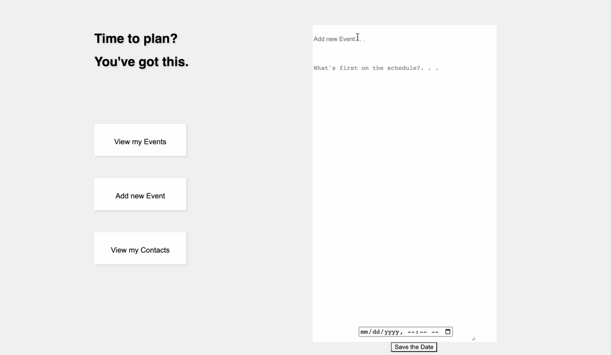
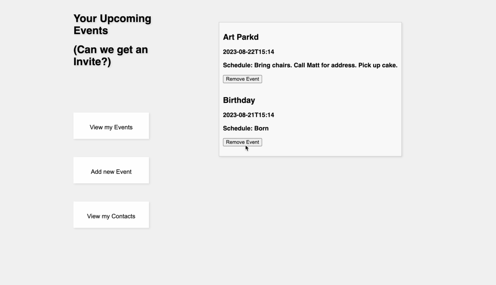

# **Save the Date**

Learn more about Jennifer: https://www.linkedin.com/in/jennifer-kash-96247b174/

Save the Date is a web application built by Jennifer Kash. Faced with her first project
full stack project, she is excited to create something inspired by her every day life 
and that can be used practically to assisst in her day to day. Coming from a past of event planning, her application can be used to create a bank of important events, date and time, and schedules and reminders for these events. Her focus for this project was a sleek and intuitive design with full functionality. 

# Technologies Used
- Javascript
- Node.js
- Express
- Axios
- HTML
- CSS

# How to Locally Run Save the Date

This application is yet to be deployed. Follow these instructions to run the app locally. 

1. Access the 'Save the Date' repository on Github.
2. Above the list of files, click the green '< > Code' button. 
3. Copy the URL for the repository. 
4. Open Terminal.
5. Change the current working directory to the location where you want the cloned directory.
6. Type 'git clone' and then paste the URL from the repository. 
7. Press enter to create your local clone. 
8. Start the server by typing 'node server/server.js' in your terminal. 
9. Open a tab in your browser and type in 'localhost:4050'.
10. Explore the app.